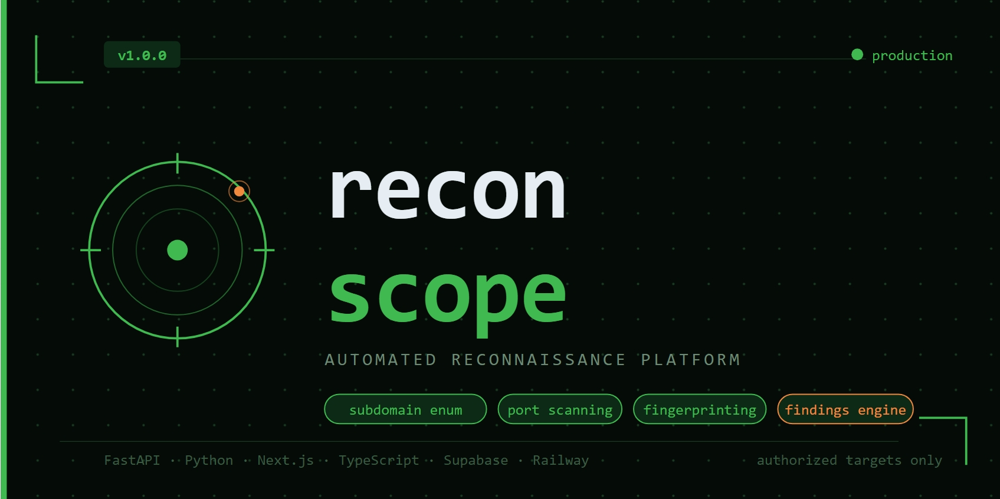
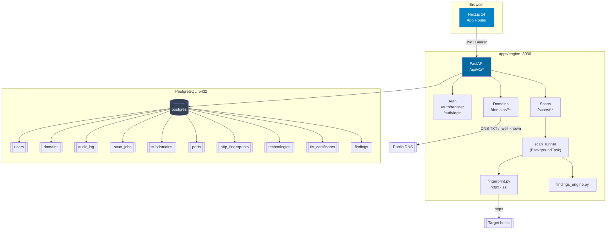
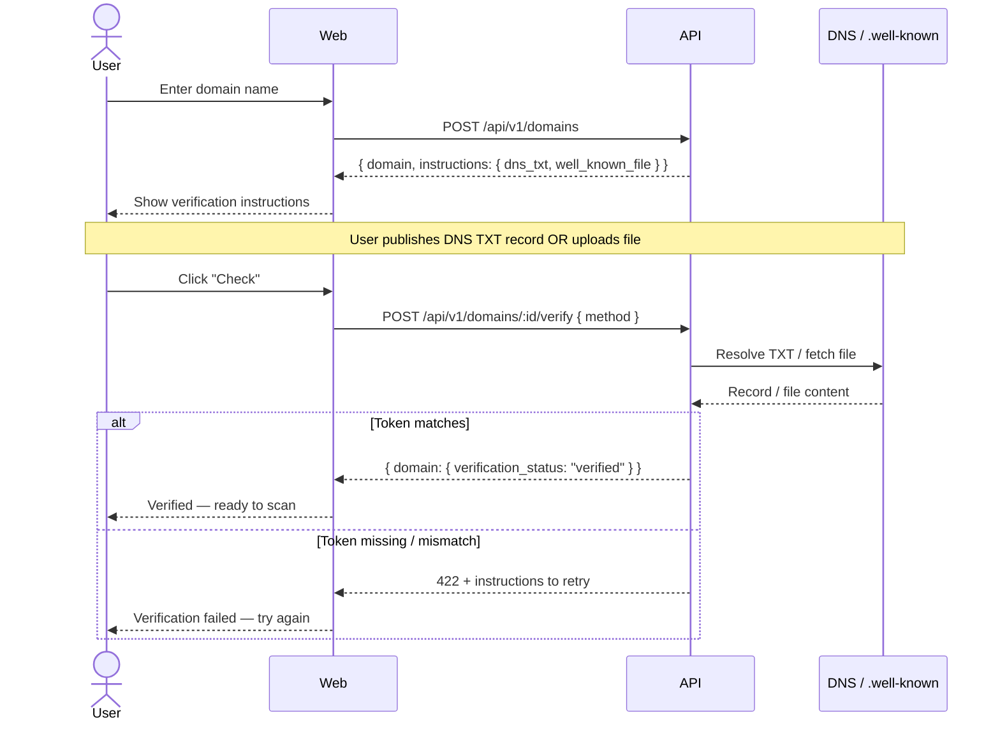

    

# recon-scope

> Automated reconnaissance platform for authorized security assessments.

---

## Features

- **Subdomain Enumeration** — passive recon via certificate transparency (crt.sh), async DNS resolution with asyncio + dnspython
- **Port Scanning** — pure Python asyncio TCP connect scan, Semaphore(200), banner grabbing, static service inference. No nmap dependency.
- **HTTP Fingerprinting** — headers, title parsing, tech stack detection (nginx, Cloudflare, Vercel, WordPress, Django, Laravel and more)
- **TLS Analysis** — certificate validity, expiry, SAN, signature algorithm
- **Findings Engine** — severity-ranked findings (critical/high/medium/low/info) with evidence. Rules: exposed DB ports, SSH exposure, invalid TLS, missing security headers, server version disclosure.
- **Domain Ownership Verification** — DNS TXT or well-known file verification before any scan. No unauthorized scanning possible.
- **Audit Log** — every action logged with user, target, IP, and timestamp.
- **Export** — full scan report as JSON (API) or PDF (client-side, jsPDF).

---

## Architecture



### Ownership verification gate



---

## Tech Stack

| Layer | Technology |
|---|---|
| Frontend | Next.js 14 (App Router), TypeScript, Tailwind CSS v3, Recharts |
| Backend | FastAPI, Python 3.12, asyncio, SQLAlchemy 2 (async), Alembic |
| Database | PostgreSQL 16, asyncpg |
| Infrastructure | Docker, Docker Compose |

---

## Security Design

Domain ownership verification is mandatory before any scan can be initiated. Users must prove control of a domain by publishing a DNS TXT record at `_recon-verify.<domain>` or placing a token file at `/.well-known/recon-verification.txt`. This mirrors the approach used by Google Search Console and certificate authorities.

Authorization is enforced at the application level. Every database query filters by `user_id`. The FastAPI engine uses a service role key and is the sole trusted writer. All actions — domain registration, verification, scan start, scan completion, report generation — are written to a persistent `audit_log` table that survives domain or user deletion.

Production deployments return no stack traces. All unhandled exceptions are caught by a global handler that logs internally and returns a generic 500 response. Rate limiting on `POST /scans` (10 requests/hour per user) prevents abuse.

---

## Quick Start

### Prerequisites

- Docker + Docker Compose
- A `.env` file (copy `.env.example`)

### 1. Configure environment

```bash
cp .env.example .env
# Set JWT_SECRET to a strong random value:
# python -c "import secrets; print(secrets.token_hex(64))"
```

### 2. Start all services

```bash
docker compose -f infra/docker-compose.yml up --build
```

The engine container runs `alembic upgrade head` automatically before starting. No manual migration step needed.

| Service | URL |
|---|---|
| Web dashboard | http://localhost:3000 |
| Engine API | http://localhost:8000 |
| API docs (DEBUG=true only) | http://localhost:8000/docs |
| Health check | http://localhost:8000/api/v1/health |

### Environment variables

| Variable | Required | Default | Description |
|---|---|---|---|
| `DATABASE_URL` | Yes | — | `postgresql+asyncpg://...` connection string |
| `JWT_SECRET` | Yes | — | HS256 signing key |
| `JWT_EXPIRES_DAYS` | No | `7` | Token lifetime in days |
| `BCRYPT_ROUNDS` | No | `12` | bcrypt work factor |
| `CORS_ORIGINS` | No | `["http://localhost:3000"]` | JSON array of allowed origins |
| `DEBUG` | No | `false` | Enables `/docs`, `/redoc`, verbose errors |
| `NEXT_PUBLIC_API_URL` | Yes (web) | `http://localhost:8000` | Engine base URL visible to the browser |

---

## API Reference

All endpoints are prefixed with `/api/v1`. Authenticated endpoints require `Authorization: Bearer <token>`.

### Auth

| Method | Path | Auth | Description |
|---|---|---|---|
| `POST` | `/auth/register` | — | Create account. Body: `{ email, password, tos_accepted: true }` |
| `POST` | `/auth/login` | — | Obtain token. Body: `{ email, password }` |

Both return `{ token, user }`.

### Domains

| Method | Path | Auth | Description |
|---|---|---|---|
| `GET` | `/domains` | Required | List user's domains |
| `POST` | `/domains` | Required | Register a domain |
| `GET` | `/domains/:id` | Required | Domain detail + verification instructions |
| `POST` | `/domains/:id/verify` | Required | Trigger ownership check. Body: `{ method: "dns_txt" \| "well_known_file" }` |
| `DELETE` | `/domains/:id` | Required | Remove domain |
| `GET` | `/domains/:id/history` | Required | Scan history with per-run severity counts |

### Scans

| Method | Path | Auth | Description |
|---|---|---|---|
| `POST` | `/scans` | Required | Start a scan (rate-limited: 10/hour per user) |
| `GET` | `/scans` | Required | List all scan jobs for the user |
| `GET` | `/scans/:id` | Required | Job status + full results when completed |
| `GET` | `/scans/:id/export/json` | Required | Download results as JSON file |

**POST /scans** body:

```json
{
  "domain_id": "<uuid>",
  "modules": ["subdomains", "ports", "fingerprint"],
  "port_range": "top-1000",
  "passive_only": true,
  "timeout_seconds": 30
}
```

**GET /scans/:id** response (completed):

```json
{
  "job": { "id": "...", "status": "completed", "progress": 100, ... },
  "subdomains": [{ "hostname": "api.example.com", "resolved_ip": "1.2.3.4", ... }],
  "ports": [{ "host": "1.2.3.4", "port": 443, "protocol": "tcp", "service": "https", ... }],
  "technologies": [{ "name": "nginx", "category": "web-server", "confidence": 90, ... }],
  "tls_certificates": [{ "host": "example.com", "issuer": "Let's Encrypt", "is_valid": true, ... }],
  "findings": [{ "severity": "high", "category": "exposed_service", "title": "...", ... }]
}
```

### Health

| Method | Path | Auth | Description |
|---|---|---|---|
| `GET` | `/health` | — | Returns `{ status: "ok", version: "1.0.0", db: "connected" }` |

---

## Roadmap

- [ ] Active DNS brute-force (behind ownership gate)
- [ ] Shodan API integration for passive port intel
- [ ] Scheduled recurring scans with change detection
- [ ] Slack / webhook notifications on new findings
- [ ] AWS deployment option (ECS + RDS)
- [ ] CompTIA Security+ exam prep integration (study mode)
