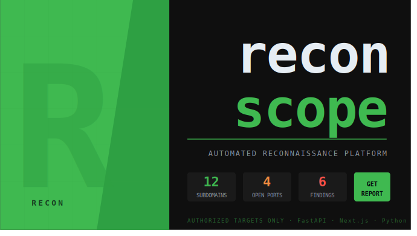
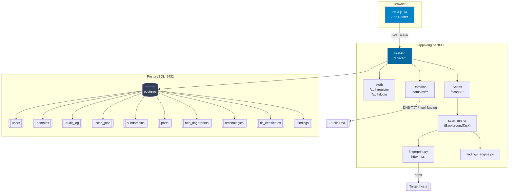
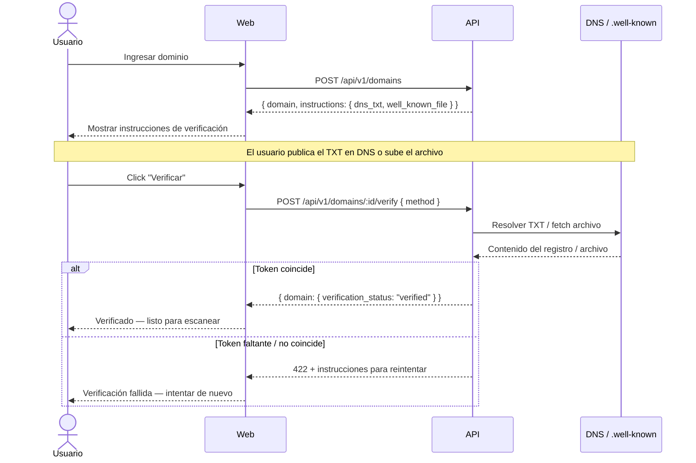

    

# recon-scope

> Plataforma de reconocimiento automatizado para assessments de seguridad autorizados.

---

## Funcionalidades

- **Enumeración de subdominios** — recon pasivo vía certificate transparency (crt.sh), resolución DNS asíncrona con asyncio + dnspython
- **Escaneo de puertos** — TCP connect scan en Python puro con asyncio, Semaphore(200), banner grabbing e inferencia de servicios. Sin dependencia de nmap.
- **HTTP Fingerprinting** — análisis de headers, parsing de título, detección de stack tecnológico (nginx, Cloudflare, Vercel, WordPress, Django, Laravel y más)
- **Análisis TLS** — validez del certificado, expiración, SAN, algoritmo de firma
- **Motor de findings** — hallazgos rankeados por severidad (critical/high/medium/low/info) con evidencia. Reglas: puertos DB expuestos, exposición SSH, TLS inválido, headers de seguridad faltantes, divulgación de versión de servidor.
- **Verificación de propiedad de dominio** — verificación vía DNS TXT o archivo well-known antes de cualquier scan. Sin posibilidad de escanear targets no autorizados.
- **Audit log** — cada acción registrada con usuario, target, IP y timestamp.
- **Exportación** — reporte completo como JSON (API) o PDF (client-side, jsPDF).

---

## Arquitectura



### Gate de verificación de propiedad



---

## Stack tecnológico

| Capa | Tecnología |
|---|---|
| Frontend | Next.js 14 (App Router), TypeScript, Tailwind CSS v3, Recharts |
| Backend | FastAPI, Python 3.12, asyncio, SQLAlchemy 2 (async), Alembic |
| Base de datos | PostgreSQL 16, asyncpg |
| Infraestructura | Docker, Docker Compose |

---

## Diseño de seguridad

La verificación de propiedad de dominio es obligatoria antes de iniciar cualquier scan. Los usuarios deben demostrar control del dominio publicando un registro DNS TXT en `_recon-verify.<dominio>` o colocando un archivo token en `/.well-known/recon-verification.txt`. Esto replica el enfoque utilizado por Google Search Console y las autoridades certificadoras.

La autorización se aplica a nivel de aplicación. Cada consulta a la base de datos filtra por `user_id`. El engine FastAPI es el único escritor de confianza. Todas las acciones — registro de dominio, verificación, inicio de scan, finalización de scan, generación de reporte — se escriben en una tabla `audit_log` persistente que sobrevive la eliminación del dominio o del usuario.

Los deployments en producción no devuelven stack traces. Todas las excepciones no manejadas son capturadas por un handler global que registra internamente y devuelve una respuesta 500 genérica. El rate limiting en `POST /scans` (10 requests/hora por usuario) previene abusos.

---

## Inicio rápido

### Prerequisitos

- Docker + Docker Compose
- Archivo `.env` (copiar `.env.example`)

### 1. Configurar entorno

```bash
cp .env.example .env
# Generar JWT_SECRET con un valor aleatorio fuerte:
# python -c "import secrets; print(secrets.token_hex(64))"
```

### 2. Levantar todos los servicios

```bash
docker compose -f infra/docker-compose.yml up --build
```

El contenedor del engine ejecuta `alembic upgrade head` automáticamente antes de iniciar. No se necesita ningún paso de migración manual.

| Servicio | URL |
|---|---|
| Dashboard web | http://localhost:3000 |
| Engine API | http://localhost:8000 |
| Docs API (solo DEBUG=true) | http://localhost:8000/docs |
| Health check | http://localhost:8000/api/v1/health |

### Variables de entorno

| Variable | Requerida | Default | Descripción |
|---|---|---|---|
| `DATABASE_URL` | Sí | — | Connection string `postgresql+asyncpg://...` |
| `JWT_SECRET` | Sí | — | Clave de firma HS256 |
| `JWT_EXPIRES_DAYS` | No | `7` | Duración del token en días |
| `BCRYPT_ROUNDS` | No | `12` | Factor de trabajo bcrypt |
| `CORS_ORIGINS` | No | `["http://localhost:3000"]` | Array JSON de orígenes permitidos |
| `DEBUG` | No | `false` | Habilita `/docs`, `/redoc` y errores detallados |
| `NEXT_PUBLIC_API_URL` | Sí (web) | `http://localhost:8000` | URL base del engine visible desde el browser |

---

## Referencia de API

Todos los endpoints tienen el prefijo `/api/v1`. Los endpoints autenticados requieren `Authorization: Bearer <token>`.

### Auth

| Método | Path | Auth | Descripción |
|---|---|---|---|
| `POST` | `/auth/register` | — | Crear cuenta. Body: `{ email, password, tos_accepted: true }` |
| `POST` | `/auth/login` | — | Obtener token. Body: `{ email, password }` |

Ambos devuelven `{ token, user }`.

### Dominios

| Método | Path | Auth | Descripción |
|---|---|---|---|
| `GET` | `/domains` | Requerida | Listar dominios del usuario |
| `POST` | `/domains` | Requerida | Registrar un dominio |
| `GET` | `/domains/:id` | Requerida | Detalle del dominio + instrucciones de verificación |
| `POST` | `/domains/:id/verify` | Requerida | Disparar verificación de propiedad. Body: `{ method: "dns_txt" \| "well_known_file" }` |
| `DELETE` | `/domains/:id` | Requerida | Eliminar dominio |
| `GET` | `/domains/:id/history` | Requerida | Historial de scans con conteos de severidad por ejecución |

### Scans

| Método | Path | Auth | Descripción |
|---|---|---|---|
| `POST` | `/scans` | Requerida | Iniciar un scan (rate-limited: 10/hora por usuario) |
| `GET` | `/scans` | Requerida | Listar todos los scan jobs del usuario |
| `GET` | `/scans/:id` | Requerida | Estado del job + resultados completos cuando finaliza |
| `GET` | `/scans/:id/export/json` | Requerida | Descargar resultados como archivo JSON |

**Body de POST /scans:**

```json
{
  "domain_id": "<uuid>",
  "modules": ["subdomains", "ports", "fingerprint"],
  "port_range": "top-1000",
  "passive_only": true,
  "timeout_seconds": 30
}
```

**Respuesta de GET /scans/:id (completado):**

```json
{
  "job": { "id": "...", "status": "completed", "progress": 100, ... },
  "subdomains": [{ "hostname": "api.example.com", "resolved_ip": "1.2.3.4", ... }],
  "ports": [{ "host": "1.2.3.4", "port": 443, "protocol": "tcp", "service": "https", ... }],
  "technologies": [{ "name": "nginx", "category": "web-server", "confidence": 90, ... }],
  "tls_certificates": [{ "host": "example.com", "issuer": "Let's Encrypt", "is_valid": true, ... }],
  "findings": [{ "severity": "high", "category": "exposed_service", "title": "...", ... }]
}
```

### Health

| Método | Path | Auth | Descripción |
|---|---|---|---|
| `GET` | `/health` | — | Devuelve `{ status: "ok", version: "1.0.0", db: "connected" }` |

---

## Roadmap

- [ ] DNS brute-force activo (detrás del gate de verificación de propiedad)
- [ ] Integración con la API de Shodan para inteligencia pasiva de puertos
- [ ] Scans recurrentes programados con detección de cambios
- [ ] Notificaciones por Slack / webhook ante nuevos findings
- [ ] Opción de deploy en AWS (ECS + RDS)
- [ ] Integración de preparación para CompTIA Security+ (modo estudio)

---

## Autor

**Franco Villagra** — Desarrollador · Ciberseguridad

- Portfolio: [francoverse.vercel.app](https://francoverse.vercel.app)
- GitHub: [@francovillagra](https://github.com/francovillagra)

---

## Licencia

MIT — libre para usar, modificar y distribuir.
