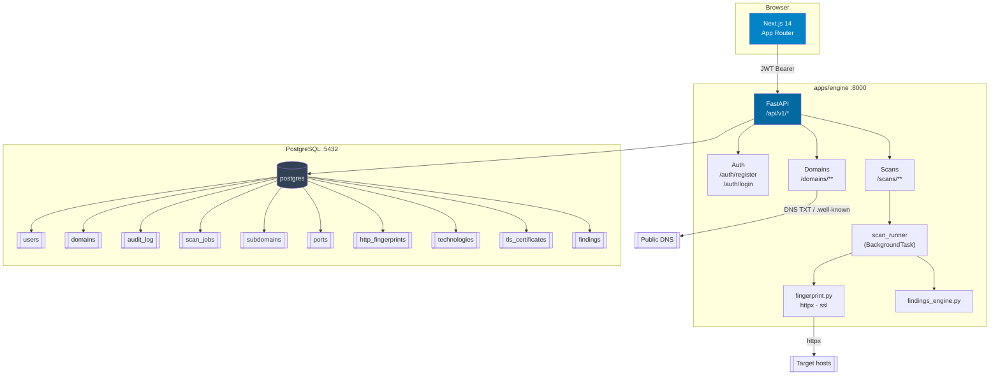
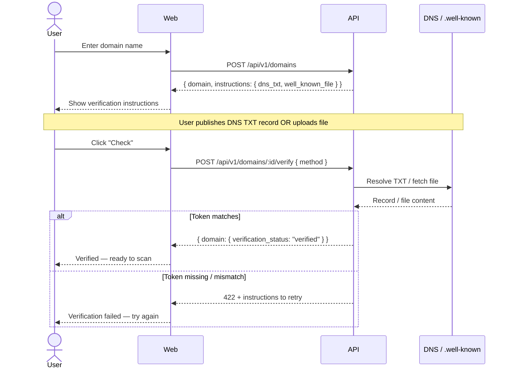

# recon-scope

> Automated reconnaissance platform for authorized security assessments.

---

## Screenshot

_Screenshot coming soon_

---

## Features

- **Subdomain enumeration** — passive discovery via crt.sh with async DNS resolution; no brute-force, no noise
- **Port scanning** — asyncio TCP connect scan with top-100, top-1000, or full (1–65535) port ranges and banner grabbing
- **HTTP fingerprinting** — server headers, page title, tech stack detection (framework, CDN, CMS), TLS certificate capture
- **Security findings** — automated finding generation with severity levels (critical / high / medium / low / info) and category tagging
- **Export** — download results as JSON (full structured data) or PDF (client-side via jsPDF)
- **Domain ownership gate** — enforced at both application and database level; no target can be scanned without verified ownership

---

## Architecture



### Ownership verification gate



---

## Tech Stack

| Layer | Technology |
|---|---|
| Frontend | Next.js 14 (App Router), TypeScript, Tailwind CSS v3, Recharts |
| Backend | FastAPI, Python 3.12, asyncio, SQLAlchemy 2 (async), Alembic |
| Database | PostgreSQL 16, asyncpg |
| Infrastructure | Docker, Docker Compose |

---

## Security Design

**Domain ownership verification** is the central safety mechanism. Every domain must pass an ownership check before any scan can be initiated. This is enforced at two independent layers: the application validates `verification_status === "verified"` and returns HTTP 422 if it is not, and a PostgreSQL trigger (`trg_scan_jobs_domain_verified`) raises an exception if a `scan_jobs` INSERT references an unverified domain. Neither layer alone is sufficient — both must pass.

**Authentication** uses HS256 JWTs with bcrypt password hashing (configurable rounds, default 12). Tokens expire after 7 days. The login endpoint performs a constant-time dummy hash comparison when the email does not exist to prevent timing-based user enumeration. Passwords are never returned by any endpoint.

**Audit logging** records every significant action — registration, domain verification attempts (success and failure), and scan starts — with the requester's IP address and a metadata payload. This provides a chain of custody for every scan that runs on the platform.

**Authorized targets only.** The platform is designed exclusively for security testing against targets you own or have explicit written permission to test. Unauthorized scanning is illegal in most jurisdictions. The ownership verification gate, combined with scan attribution to a specific user, makes it technically and legally clear who authorized each assessment.

---

## Quick Start

### Prerequisites

- Docker + Docker Compose
- A `.env` file (copy `.env.example`)

### 1. Configure environment

```bash
cp .env.example .env
# Set JWT_SECRET to a strong random value:
# python -c "import secrets; print(secrets.token_hex(64))"
```

### 2. Start all services

```bash
docker compose -f infra/docker-compose.yml up --build
```

The engine container runs `alembic upgrade head` automatically before starting. No manual migration step needed.

| Service | URL |
|---|---|
| Web dashboard | http://localhost:3000 |
| Engine API | http://localhost:8000 |
| API docs (DEBUG=true only) | http://localhost:8000/docs |
| Health check | http://localhost:8000/api/v1/health |

### Environment variables

| Variable | Required | Default | Description |
|---|---|---|---|
| `DATABASE_URL` | Yes | — | `postgresql+asyncpg://...` connection string |
| `JWT_SECRET` | Yes | — | HS256 signing key |
| `JWT_EXPIRES_DAYS` | No | `7` | Token lifetime in days |
| `BCRYPT_ROUNDS` | No | `12` | bcrypt work factor |
| `CORS_ORIGINS` | No | `["http://localhost:3000"]` | JSON array of allowed origins |
| `DEBUG` | No | `false` | Enables `/docs`, `/redoc`, verbose errors |
| `NEXT_PUBLIC_API_URL` | Yes (web) | `http://localhost:8000` | Engine base URL visible to the browser |

---

## API Reference

All endpoints are prefixed with `/api/v1`. Authenticated endpoints require `Authorization: Bearer <token>`.

### Auth

| Method | Path | Auth | Description |
|---|---|---|---|
| `POST` | `/auth/register` | — | Create account. Body: `{ email, password, tos_accepted: true }` |
| `POST` | `/auth/login` | — | Obtain token. Body: `{ email, password }` |

Both return `{ token, user }`.

### Domains

| Method | Path | Auth | Description |
|---|---|---|---|
| `GET` | `/domains` | Required | List user's domains |
| `POST` | `/domains` | Required | Register a domain |
| `GET` | `/domains/:id` | Required | Domain detail + verification instructions |
| `POST` | `/domains/:id/verify` | Required | Trigger ownership check. Body: `{ method: "dns_txt" \| "well_known_file" }` |
| `DELETE` | `/domains/:id` | Required | Remove domain |
| `GET` | `/domains/:id/history` | Required | Scan history with per-run severity counts |

### Scans

| Method | Path | Auth | Description |
|---|---|---|---|
| `POST` | `/scans` | Required | Start a scan (rate-limited: 10/hour per user) |
| `GET` | `/scans` | Required | List all scan jobs for the user |
| `GET` | `/scans/:id` | Required | Job status + full results when completed |
| `GET` | `/scans/:id/export/json` | Required | Download results as JSON file |

**POST /scans** body:

```json
{
  "domain_id": "<uuid>",
  "modules": ["subdomains", "ports", "fingerprint"],
  "port_range": "top-1000",
  "passive_only": true,
  "timeout_seconds": 30
}
```

**GET /scans/:id** response (completed):

```json
{
  "job": { "id": "...", "status": "completed", "progress": 100, ... },
  "subdomains": [{ "hostname": "api.example.com", "resolved_ip": "1.2.3.4", ... }],
  "ports": [{ "host": "1.2.3.4", "port": 443, "protocol": "tcp", "service": "https", ... }],
  "technologies": [{ "name": "nginx", "category": "web-server", "confidence": 90, ... }],
  "tls_certificates": [{ "host": "example.com", "issuer": "Let's Encrypt", "is_valid": true, ... }],
  "findings": [{ "severity": "high", "category": "exposed_service", "title": "...", ... }]
}
```

### Health

| Method | Path | Auth | Description |
|---|---|---|---|
| `GET` | `/health` | — | Returns `{ status: "ok", version: "1.0.0", db: "connected" }` |

---

## Roadmap

| Feature | Notes |
|---|---|
| Active DNS brute-force | Behind an additional per-domain authorization step |
| Shodan integration | Correlate open ports with known CVEs |
| Scheduled scans | Cron-based recurring recon with delta findings |
| Slack / webhook alerts | Notify on new critical/high findings |
| Multi-user organizations | Shared domain workspace with role-based access |
